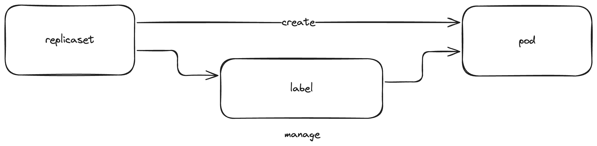
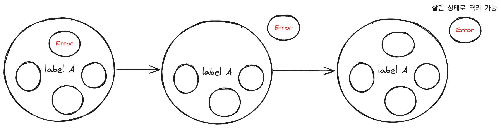

# 9장. 레플리카 셋

## 컨테이너의 여러 복제본이 필요한 이유
- 고가용성
- 확장성
- 속도 증가(병렬 처리)

</br>

## 레플리카 셋을 사용해야 하는 이유
- 휴먼 에러의 감소
- 파드의 복제본 집합을 명세를 통해 손쉽게 생성하고 관리 가능

</br>

## 조정 루프란?
- 원하는 상태: 명세
- 현재 상태: 시스템의 현재 상태
- 조정 루프의 역할: 현재 상태를 관찰하고 관찰된 상태가 원하는 상태와 일치되도록 동작 시키는 것
    - 노드가 사라지거나 장애가 발생하면 이를 다시 클러스트에 참가시킴
    - 사용자의 요청에 따른 확장과 축소를 처리

</br>

## 파드와 레플리카 셋의 관계

### pod와 replicaSet을 분리함으로써 오는 장점1: 기존 container의 수용 가능
- label만 맞으면 기존 만들어진 pod를 새로 만들어지는 RS를 통해 관리 가능
기존 Pod
```yml
apiVersion: v1
kind: Pod
metadata:
  name: existing-pod
  labels:
    app: my-app
spec:
  containers:
    - name: nginx
      image: nginx
```
이번에 만든 RS
```yml
apiVersion: apps/v1
kind: ReplicaSet
metadata:
  name: my-replicaset
spec:
  replicas: 3
  selector:
    matchLabels:
      app: my-app
  template:
    metadata:
      labels:
        app: my-app
    spec:
      containers:
        - name: nginx
          image: nginx
```

### pod와 replicaSet을 분리함으로써 오는 장점2: 컨테이너 격리
- 단순히 문제가 있는 파드의 라벨을 변경함으로써 문제가 있는 파드를 그대로 남기면서 서비스로의 영향을 최소화 할 수 있다.



</br>

## 레플리카 셋 명세
```yml
apiVersion: apps/v1
kind: ReplicaSet 
metadata:
  labels:
    app: kuard
    version: "2"
  name: kuard
spec:
  replicas: 1
  selector:
    matchLabels: #해당 RS가 어떠한 조건을 가진 pod를 관리하는지, and 조건
      app: kuard
      version: "2"
  template: # 이 아래로 pod template
    metadata:
      labels:
        app: kuard
        version: "2"
    spec:
      containers:
        - name: kuard
          image: "gcr.io/kuar-demo/kuard-amd64:green"
          resources:
            requests:
              cpu: "500m"
              memory: "128Mi"
```

</br>

## 레플리카 셋 생성 및 확인
```zsh
➜  newbie git:(main) ✗ kubectl apply -f kuard-rs.yaml
replicaset.apps/kuard created
➜  newbie git:(main) ✗ kubectl get pods              
NAME          READY   STATUS    RESTARTS   AGE
kuard-5rhp6   1/1     Running   0          10s
```

## 레플리카 셋 검사(kubectl describe)
```
Print a detailed description of the selected resources, including related resources such as events or controllers. You
may select a single object by name, all objects of that type, provide a name prefix, or label selector. For example:

  $ kubectl describe TYPE NAME_PREFIX
  
 will first check for an exact match on TYPE and NAME_PREFIX. If no such resource exists, it will output details for
every resource that has a name prefixed with NAME_PREFIX.
```

```bash
➜  newbie git:(main) ✗ kubectl describe rs      
Name:         kuard
Namespace:    default
Selector:     app=kuard,version=2
Labels:       app=kuard
              version=2
Annotations:  kubectl.kubernetes.io/last-applied-configuration:
                {"apiVersion":"apps/v1","kind":"ReplicaSet","metadata":{"annotations":{},"labels":{"app":"kuard","version":"2"},"name":"kuard","namespace"...
Replicas:     1 current / 1 desired
Pods Status:  1 Running / 0 Waiting / 0 Succeeded / 0 Failed
Pod Template:
  Labels:  app=kuard
           version=2
  Containers:
   kuard:
    Image:      gcr.io/kuar-demo/kuard-amd64:green
    Port:       <none>
    Host Port:  <none>
    Requests:
      cpu:        500m
      memory:     128Mi
    Environment:  <none>
    Mounts:       <none>
  Volumes:        <none>
Events:
  Type    Reason            Age   From                   Message
  ----    ------            ----  ----                   -------
  Normal  SuccessfulCreate  12m   replicaset-controller  Created pod: kuard-5rhp6
```

</br>

## ownerReferences란?
- 한 오브젝트가 다른 오브젝트에 종속되어 있음을 나타내는 필드 값. 특히, 특정 오브젝트가 다른 오브젝트에 의해 생성되었거나 관리되고 있다는 정보를 담고 있으며 종속된 오브젝트가 소유자 오브젝트가 삭제될 때 함께 삭제되도록 보장
- 목록:
    - apiVersion: 소유자 오브젝트의 API 버전.
    - kind: 소유자 오브젝트의 종류 (예: Pod, Deployment 등).
    - name: 소유자 오브젝트의 이름.
    - uid: 소유자 오브젝트의 고유 식별자.
    - controller (optional): 이 값이 true로 설정된 경우, 해당 소유자가 오브젝트의 컨트롤러라는 것을 나타냅니다.
    - blockOwnerDeletion (optional): 이 값이 true인 경우, 소유자가 삭제되기 전에 해당 오브젝트가 삭제되지 않도록 보장합니다.
```
newbie git:(main) ✗ kubectl get pods kuard-5rhp6 -o=jsonpath='{.metadata.ownerReferences}'
[map[apiVersion:apps/v1 blockOwnerDeletion:true controller:true kind:ReplicaSet name:kuard uid:cec3608f-f208-4ae8-a597-141f60ae252c]]%  
```

</br>

## selector에 해당하는 파드 찾기
```
➜  newbie git:(main) ✗ kubectl get pods --selector app=kuard,version=2                       
NAME          READY   STATUS    RESTARTS   AGE
kuard-5rhp6   1/1     Running   0          27m
```

</br>

## 확장
### 명령형 확장(kubectl scale)
```
➜  newbie git:(main) ✗ kubectl scale replicasets kuard --replicas=4   
replicaset.apps/kuard scaled
➜  newbie git:(main) ✗ kubectl get pods --selector app=kuard,version=2
NAME          READY   STATUS    RESTARTS   AGE
kuard-5rhp6   1/1     Running   0          28m
kuard-858fr   1/1     Running   0          6s
kuard-ff2rr   1/1     Running   0          6s
kuard-xwx7r   1/1     Running   0          6s
```
- 주의: 명령형 확장을 할 때는 파일에 적혀 있는 정보와 실제 파드 수의 상태가 다를 수 있다. 이는 다른 개발자들에게 상황 파악을 어렵게 할 수 있다.
### 선언형 확장(kubectl apply)
- 앞에서 이야기했듯 그저 명세를 수정하고 다시 제출한다.

### 자동 확장(kubectl autoscale)
- HPA
    - CPU, 메모리와 같은 메트릭스를 모니터링하고, 설정된 임계값에 도달하면 자동으로 파드 수를 증가시키거나 감소
    - 이거 도달하면 일꾼 더 투입시켜
        ```yml
        apiVersion: autoscaling/v1
        kind: HorizontalPodAutoscaler
        metadata:
        name: my-hpa
        spec:
        scaleTargetRef:
            apiVersion: apps/v1
            kind: Deployment
            name: my-deployment   # 타겟으로 설정할 디플로이먼트 이름
        minReplicas: 1          # 최소 파드 수
        maxReplicas: 10         # 최대 파드 수
        targetCPUUtilizationPercentage: 50  # CPU 사용률 기준
        ```
- VPA
    - 파드의 리소스를 수직으로 확장하여 애플리케이션이 요구하는 리소스를 더 효과적으로 관리
    - 이거 도달하면 각 파드에 자원 더 넣어줘
        ```yml
        apiVersion: autoscaling.k8s.io/v1
        kind: VerticalPodAutoscaler
        metadata:
        name: my-vpa
        spec:
        targetRef:
            apiVersion: apps/v1
            kind: Deployment
            name: my-deployment   # 타겟으로 설정할 디플로이먼트 이름
        updatePolicy:
            updateMode: "Auto"    # 자동으로 리소스 조정 (권장값: Auto)
        resourcePolicy:
            containerPolicies:
            - containerName: "*"
                minAllowed:
                cpu: 200m      # 최소 CPU 리소스
                memory: 256Mi  # 최소 메모리 리소스
                maxAllowed:
                cpu: 1         # 최대 CPU 리소스
                memory: 1Gi    # 최대 메모리 리소스
        ```

</br>

## 삭제(kubectl delete)
```
➜  newbie git:(main) ✗ kubectl delete rs kuard    
replicaset.apps "kuard" deleted      
➜  newbie git:(main) ✗ kubectl get pods              
No resources found in default namespace.
```

```
➜  newbie git:(main) ✗ kubectl get pods                               
NAME          READY   STATUS    RESTARTS   AGE
kuard-7nr7k   1/1     Running   0          15s
kuard-s776v   1/1     Running   0          15s
See 'kubectl delete --help' for usage.
➜  newbie git:(main) ✗ kubectl delete rs kuard --cascade=false
replicaset.apps "kuard" deleted
➜  newbie git:(main) ✗ kubectl get pods                       
NAME          READY   STATUS    RESTARTS   AGE
kuard-7nr7k   1/1     Running   0          62s
kuard-s776v   1/1     Running   0          62s
```
