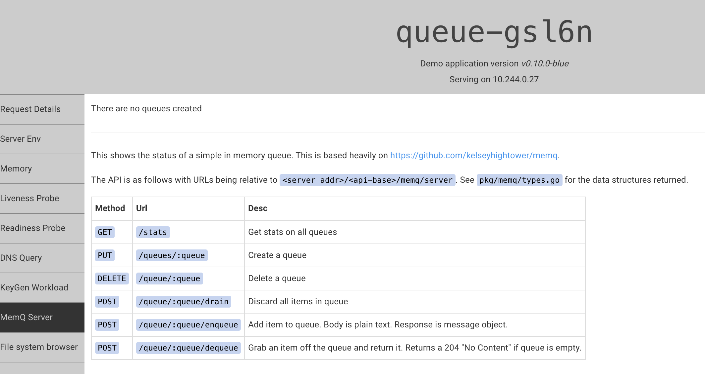

# 12장 job

## 만들어진 목적
- 단기간의 일회성 작업을 실행하기 위해
- 종료 코드에 상관없이 지속적으로 재시작하는 일반 pod와는 달리 종료코드 0으로 끝나면 재시작 되지 않음

## job 객체
- 잡 명세 템플릿에 정의된 파드를 생성 및 관리
- 잡이 종료코드 0으로 끝나지 않는 경우 파드 템를릿을 기반으로 새로운 pod 생성
```yml
apiVersion: batch/v1
kind: Job
metadata:
  name: oneshot
spec:
  template:
    spec:
      containers:
      - name: kuard
        image: gcr.io/kuar-demo/kuard-amd64:blue
        imagePullPolicy: Always
        command:
        - "/kuard"
        args:
        - "--keygen-enable" 
        - "--keygen-exit-on-complete" # 성공시 종료
        - "--keygen-num-to-gen=10" 
      restartPolicy: OnFailure # 실패시 job 객체 생성
```

## job pattern
- 각 잡은 졸료코드 0으로 끝날 때까지 단일 파드를 2번 실행함
- 작업 패턴은 작업 완료 수와 병렬로 실행할 파드 수로 정의됨
- 작업 패턴
    - 원샷: 파드가 성공적으로 종료될 때까지 단일 파드를 한 번 실행하는 방법을 제공
    - 병렬 고정 완료: 여러 일을 여러 pods에서 처리함, 한번에 뜨는 pod의 개수가 제한됨(재활용이 아니라는 사실에 유의)
    - 작업 대기열: 하나의 큰 객체의 일을 여러 pods에서 병렬로 처리함

## 원 샷
```yml
apiVersion: batch/v1
kind: Job
metadata:
  name: oneshot
spec:
  template:
    spec:
      containers:
      - name: kuard
        image: gcr.io/kuar-demo/kuard-amd64:blue
        imagePullPolicy: Always
        command:
        - "/kuard"
        args:
        - "--keygen-enable"
        - "--keygen-exit-on-complete"
        - "--keygen-num-to-gen=10"
      restartPolicy: OnFailure
```
```bash
Name:           oneshot
Namespace:      default
Selector:       batch.kubernetes.io/controller-uid=ed8954e5-b567-4227-a0cb-b33b0566d35a
Labels:         batch.kubernetes.io/controller-uid=ed8954e5-b567-4227-a0cb-b33b0566d35a
                batch.kubernetes.io/job-name=oneshot
                controller-uid=ed8954e5-b567-4227-a0cb-b33b0566d35a
                job-name=oneshot
Annotations:    kubectl.kubernetes.io/last-applied-configuration:
                  {"apiVersion":"batch/v1","kind":"Job","metadata":{"annotations":{},"name":"oneshot","namespace":"default"},"spec":{"template":{"spec":{"co...
Parallelism:    1
Completions:    1
Start Time:     Mon, 21 Oct 2024 10:21:05 +0900
Completed At:   Mon, 21 Oct 2024 10:21:26 +0900
Duration:       21s
Pods Statuses:  0 Running / 1 Succeeded / 0 Failed
Pod Template:
  Labels:  batch.kubernetes.io/controller-uid=ed8954e5-b567-4227-a0cb-b33b0566d35a
           batch.kubernetes.io/job-name=oneshot
           controller-uid=ed8954e5-b567-4227-a0cb-b33b0566d35a
           job-name=oneshot
  Containers:
   kuard:
    Image:      gcr.io/kuar-demo/kuard-amd64:blue
    Port:       <none>
    Host Port:  <none>
    Command:
      /kuard
    Args:
      --keygen-enable
      --keygen-exit-on-complete
      --keygen-num-to-gen=10
    Environment:  <none>
    Mounts:       <none>
  Volumes:        <none>
Events:
  Type    Reason            Age    From            Message
  ----    ------            ----   ----            -------
  Normal  SuccessfulCreate  2m41s  job-controller  Created pod: oneshot-w4nfr
  Normal  Completed         2m20s  job-controller  Job completed
```
### 참고
```bash
➜  newbie git:(main) ✗ kubectl apply -f job-oneshot.yaml
Warning: kubectl apply should be used on resource created by either kubectl create --save-config or kubectl apply
The Job "oneshot" is invalid: spec.template: Invalid value: core.PodTemplateSpec{ObjectMeta:v1.ObjectMeta{Name:"", GenerateName:"", Namespace:"", SelfLink:"", UID:"", ResourceVersion:"", Generation:0, CreationTimestamp:time.Date(1, time.January, 1, 0, 0, 0, 0, time.UTC), DeletionTimestamp:<nil>, DeletionGracePeriodSeconds:(*int64)(nil), Labels:map[string]string{"batch.kubernetes.io/controller-uid":"54c42c9c-b4ec-43b2-b671-16c4848554ea", "batch.kubernetes.io/job-name":"oneshot", "controller-uid":"54c42c9c-b4ec-43b2-b671-16c4848554ea", "job-name":"oneshot", "run":"oneshot"}, Annotations:map[string]string(nil), OwnerReferences:[]v1.OwnerReference(nil), Finalizers:[]string(nil), ManagedFields:[]v1.ManagedFieldsEntry(nil)}, Spec:core.PodSpec{Volumes:[]core.Volume(nil), InitContainers:[]core.Container(nil), Containers:[]core.Container{core.Container{Name:"kuard", Image:"gcr.io/kuar-demo/kuard-amd64:blue", Command:[]string{"/kuard"}, Args:[]string{"--keygen-enable", "--keygen-exit-on-complete", "--keygen-num-to-gen=10"}, WorkingDir:"", Ports:[]core.ContainerPort(nil), EnvFrom:[]core.EnvFromSource(nil), Env:[]core.EnvVar(nil), Resources:core.ResourceRequirements{Limits:core.ResourceList(nil), Requests:core.ResourceList(nil), Claims:[]core.ResourceClaim(nil)}, ResizePolicy:[]core.ContainerResizePolicy(nil), RestartPolicy:(*core.ContainerRestartPolicy)(nil), VolumeMounts:[]core.VolumeMount(nil), VolumeDevices:[]core.VolumeDevice(nil), LivenessProbe:(*core.Probe)(nil), ReadinessProbe:(*core.Probe)(nil), StartupProbe:(*core.Probe)(nil), Lifecycle:(*core.Lifecycle)(nil), TerminationMessagePath:"/dev/termination-log", TerminationMessagePolicy:"File", ImagePullPolicy:"Always", SecurityContext:(*core.SecurityContext)(nil), Stdin:false, StdinOnce:false, TTY:false}, core.Container{Name:"oneshot", Image:"gcr.io/kuar-demo/kuard-amd64:blue", Command:[]string{"/kuard", "--keygen-enable", "--keygen-exit-on-complete", "--keygen-num-to-gen", "10", "-a"}, Args:[]string(nil), WorkingDir:"", Ports:[]core.ContainerPort(nil), EnvFrom:[]core.EnvFromSource(nil), Env:[]core.EnvVar(nil), Resources:core.ResourceRequirements{Limits:core.ResourceList(nil), Requests:core.ResourceList(nil), Claims:[]core.ResourceClaim(nil)}, ResizePolicy:[]core.ContainerResizePolicy(nil), RestartPolicy:(*core.ContainerRestartPolicy)(nil), VolumeMounts:[]core.VolumeMount(nil), VolumeDevices:[]core.VolumeDevice(nil), LivenessProbe:(*core.Probe)(nil), ReadinessProbe:(*core.Probe)(nil), StartupProbe:(*core.Probe)(nil), Lifecycle:(*core.Lifecycle)(nil), TerminationMessagePath:"/dev/termination-log", TerminationMessagePolicy:"File", ImagePullPolicy:"IfNotPresent", SecurityContext:(*core.SecurityContext)(nil), Stdin:true, StdinOnce:true, TTY:false}}, EphemeralContainers:[]core.EphemeralContainer(nil), RestartPolicy:"OnFailure", TerminationGracePeriodSeconds:(*int64)(0x400a9022c8), ActiveDeadlineSeconds:(*int64)(nil), DNSPolicy:"ClusterFirst", NodeSelector:map[string]string(nil), ServiceAccountName:"", AutomountServiceAccountToken:(*bool)(nil), NodeName:"", SecurityContext:(*core.PodSecurityContext)(0x4002089d60), ImagePullSecrets:[]core.LocalObjectReference(nil), Hostname:"", Subdomain:"", SetHostnameAsFQDN:(*bool)(nil), Affinity:(*core.Affinity)(nil), SchedulerName:"default-scheduler", Tolerations:[]core.Toleration(nil), HostAliases:[]core.HostAlias(nil), PriorityClassName:"", Priority:(*int32)(nil), PreemptionPolicy:(*core.PreemptionPolicy)(nil), DNSConfig:(*core.PodDNSConfig)(nil), ReadinessGates:[]core.PodReadinessGate(nil), RuntimeClassName:(*string)(nil), Overhead:core.ResourceList(nil), EnableServiceLinks:(*bool)(nil), TopologySpreadConstraints:[]core.TopologySpreadConstraint(nil), OS:(*core.PodOS)(nil), SchedulingGates:[]core.PodSchedulingGate(nil), ResourceClaims:[]core.PodResourceClaim(nil)}}: field is immutable
```
원인: 기존 oneshot으로 올렸던 job이 존재하였고 해당 job을 수정하는 것으로 착각 하였기에 발생한 오류

## 병렬 고정 완료
- completions: 끝내야 하는 일의 횟수
- parallelism: 동시에 뜰 수 있는 pods의 수
```yml
apiVersion: batch/v1
kind: Job
metadata:
  name: parallel
  labels:
    chapter: jobs
spec:
  parallelism: 5
  completions: 10
  template:
    metadata:
      labels:
        chapter: jobs
    spec:
      containers:
      - name: kuard
        image: gcr.io/kuar-demo/kuard-amd64:blue
        imagePullPolicy: Always
        command:
        - "/kuard"
        args:
        - "--keygen-enable"
        - "--keygen-exit-on-complete"
        - "--keygen-num-to-gen=10"
      restartPolicy: OnFailure
```
```bash
➜  newbie git:(main) ✗ kubectl get pods   
NAME             READY   STATUS      RESTARTS   AGE
oneshot-w4nfr    0/1     Completed   0          6h1m
parallel-2pcxp   0/1     Completed   0          73s
parallel-689g5   0/1     Completed   0          78s
parallel-6sd5s   0/1     Completed   0          75s
parallel-jssqh   0/1     Completed   0          107s
parallel-lllvw   0/1     Completed   0          107s
parallel-n8wcw   0/1     Completed   0          107s
parallel-s7r9j   0/1     Completed   0          76s
parallel-tc6m4   0/1     Completed   0          70s
parallel-xv6sr   0/1     Completed   0          107s
parallel-zz5kw   0/1     Completed   0          107s
```
- 총 끝내야 하는 job이 10개이기에 10개의 pod가 만들어진다

## 작업 대기열
### 준비물
- queue 역할을 할 Pod
  ```yml
  apiVersion: apps/v1
  kind: ReplicaSet
  metadata:
    labels:
      app: work-queue
      component: queue
      chapter: jobs
    name: queue
  spec:
    replicas: 1
    selector:
      matchLabels:
        app: work-queue
        component: queue
        chapter: jobs
    template:
      metadata:
        labels:
          app: work-queue
          component: queue
          chapter: jobs
      spec:
        containers:
        - name: queue
          image: "gcr.io/kuar-demo/kuard-amd64:blue"
          imagePullPolicy: Always
  ```
  
- 해당 pod를 서비스를 사용해 공개
  ```yml
  apiVersion: v1
  kind: Service
  metadata:
    labels:
      app: work-queue
      component: queue
      chapter: jobs
    name: queue
  spec:
    ports:
    - port: 8080
      protocol: TCP
      targetPort: 8080
    selector:
      app: work-queue
      component: queue
  ```
- 대기열 적재
  ```sh
  # Create a work queue called 'keygen'
  curl -X PUT localhost:8080/memq/server/queues/keygen

  # Create 100 work items and load up the queue.
  for i in work-item-{0..99}; do
      curl -X POST localhost:8080/memq/server/queues/keygen/enqueue -d "$i"
  done
  ```
- 내용 확인
  
- 소비 방법 지정(소비자 잡 생성)
  ```yml
  apiVersion: batch/v1
  kind: Job
  metadata:
    labels:
      app: message-queue
      component: consumer
      chapter: jobs
    name: consumers
  spec:
    parallelism: 5
    template:
      metadata:
        labels:
          app: message-queue
          component: consumer
          chapter: jobs
      spec:
        containers:
        - name: worker
          image: "gcr.io/kuar-demo/kuard-amd64:blue"
          imagePullPolicy: Always
          command:
          - "/kuard"
          args:
          - "--keygen-enable"
          - "--keygen-exit-on-complete"
          - "--keygen-memq-server=http://queue:8080/memq/server"
          - "--keygen-memq-queue=keygen"
        restartPolicy: OnFailure
  ```
