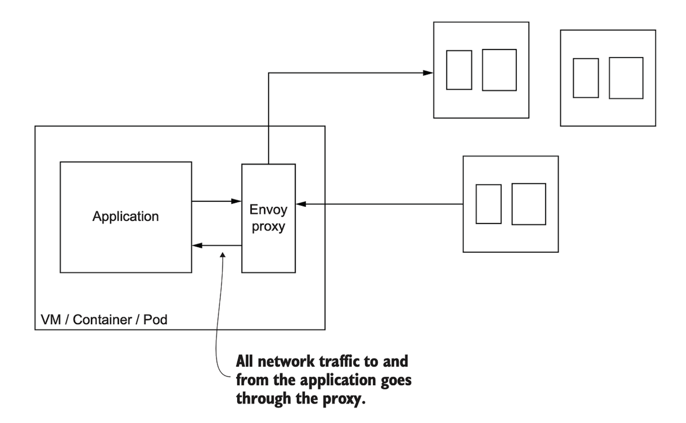
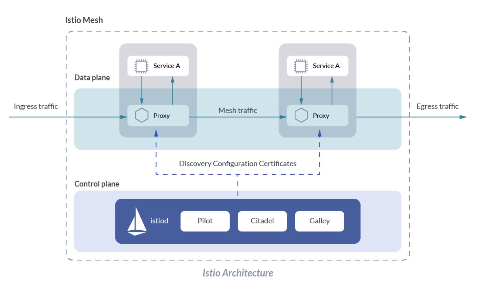

# 15장 서비스 메시

</br>

## 주의사항:
해당 책의 내용이 잘 이해되지 않는 부분이 많아(특히 서비스 메시 개념 부분) 추가적으로 https://mangkyu.tistory.com/307 의 내용을 빌렸습니다.

</br>

## 서비스 메시의 탄생 이유
```MSA를 위한 공통 관심사```는 특정 비즈니스나 개발 언어 및 프레임워크에 종속적이지 않고, 모든 시스템이 거의 동일하게 필요로 하기에 이를 언어 별로 구현하는 것은 상당한 시간 낭비이다. 그래서 공통 관심사를 애플리케이션으로부터 분리하고 인프라로 넣자는 관점이 생겼고, 이렇게 탄생한 것이 바로 Service mesh(서비스 메쉬)이다.

- MSA를 위한 공통 관심사
    - 단순 인그레스 api의 기능을 넘어 각 클라이언트가 특정 상황에서의 동작을 정의할 수 있는 방법들
        - Client-side load balancing: 호출 가능한 엔드포인트 목록을 클라이언트에게 주고, 직접 결정하도록 함
        - Service discovery: 정상 상태인 서비스들을 주기적으로 찾아 갱신하는 메커니즘
        - Circuit breaking: 문제가 있는 서비스로의 부하를 줄여주는 기술
        - Bulkheading: 클라이언트의 리소스 사용량을 임계값으로 제한하는 기술
        - Timeouts: 서비스 호출 시에 시간 제한을 적용함
        - Retries: 실패한 요청을 재시도함
        - Retry budgets: 재시도에 제약 조건을 적용합니다. 즉, 주어진 기간 동안 재시도 횟수를 제한합니다
        - Deadlines: 응답이 유효한 컨텍스트를 제공하고, 기간이 지나면 요청 처리를 무시함  

</br>

## 서비스 메시의 구조 예시(사이드카 패턴)


- Data plane:
    - 애플리케이션의 모든 트래픽이 처리되고 관찰되는 곳으로, 트래픽 설정과 보호 및 제어를 담당
- Control plane
    - 서비스 메시의 두뇌에 해당하며 운영자가 네트워크 동작을 조작할 수 있도록 API를 노출

</br>

## 서비스 메시를 사용할 때 주의할 점
- 단일 장애 포인트가 될 수 있음
    - 문제가 났을 때 해결할 수 있어야 하고 모니터링 방침을 잘 세워야 함
    - 어플리케이션에 영향을 주지 않고 새로운 버전을 릴리즈 할 수 있어야 함
- 클라우드 공급자가 서비스 메시를 제공할 수 있다면 베스트이지만 이 역시 추가적인 학습 곡선의 상승을 야기함으로 잘 생각해 보아야 함.